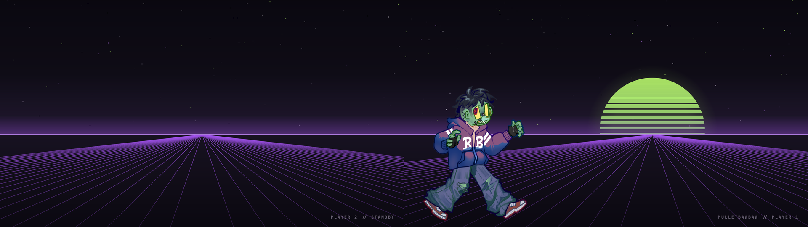
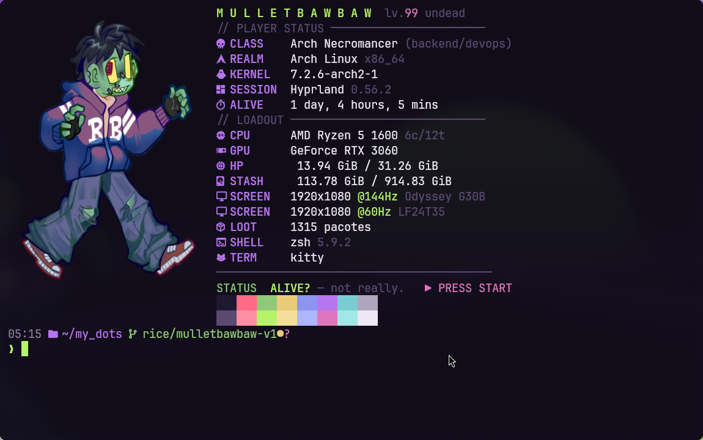
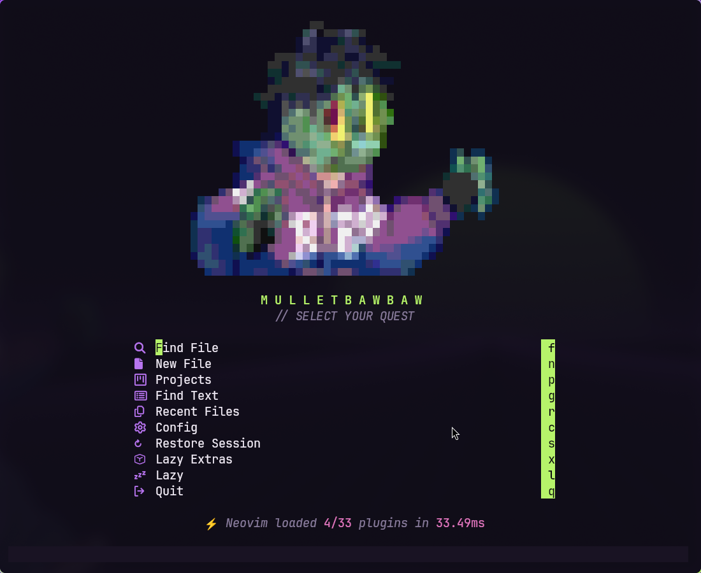
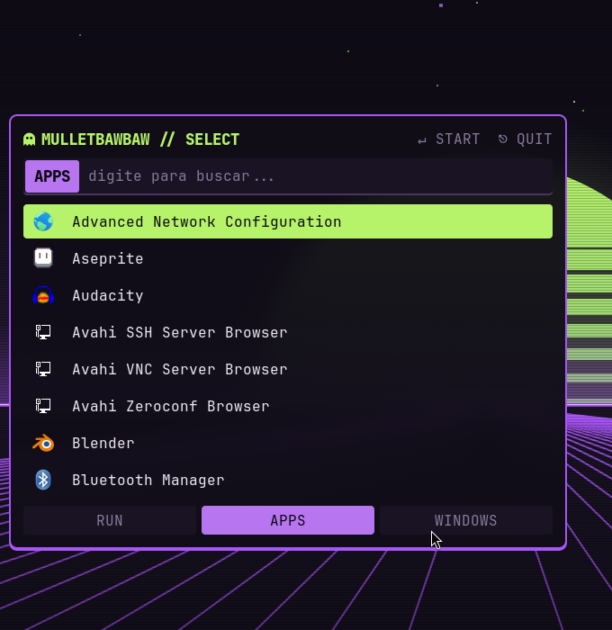
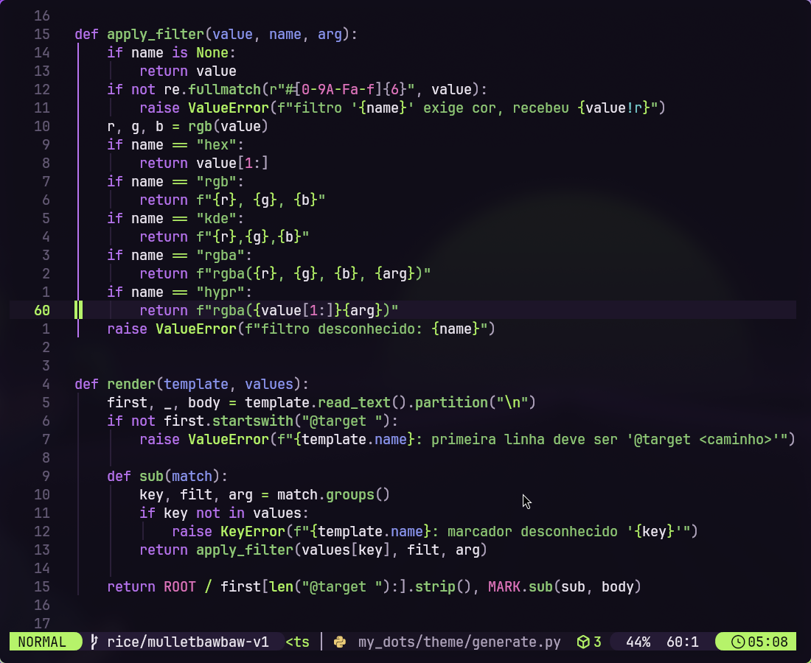
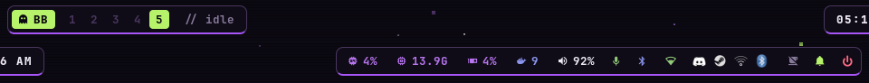
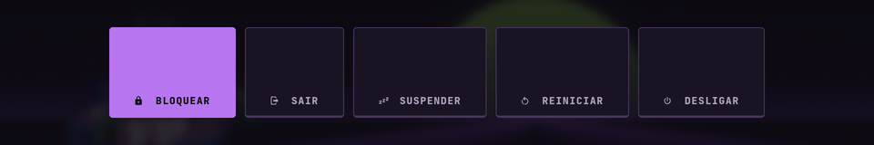

# my_dots — MulletBawbaw Undead Arcade

> Hotline Miami + Regular Show + fliperama + CRT + terminal hacker + um zumbi verde/roxo.

Rice para Arch Linux com **Hyprland** (dia a dia, código, terminal) e **KDE Plasma/X11**
(Krita, Blender, Aseprite, mesa Huion) compartilhando a mesma identidade visual.
Hardware alvo: Ryzen 5 1600 · RTX 3060 · Odyssey G30B 144 Hz + LF24T35 60 Hz.



| | |
| --- | --- |
|  |  |
|  |  |




## Como funciona

Uma paleta, vários apps: [`theme/palette.json`](theme/palette.json) → `rice-theme` →
arquivos de cor gerados para cada programa. Detalhes em
[docs/design-system.md](docs/design-system.md).

| Componente | Escolha | Onde |
| --- | --- | --- |
| Compositor | Hyprland (visual em `hypr/mulletbawbaw/rice.conf`, carregado por último) | `.config/hypr` |
| Barra | Waybar P1 (HUD completa) + P2 (enxuta) | `.config/waybar` |
| Launcher | Rofi "SELECT" | `.config/rofi/mulletbawbaw` |
| Notificações | SwayNC "INBOX" | `.config/swaync` |
| Energia / lock | wlogout "CONTINUE?" · hyprlock "GAME PAUSED" | `.config/wlogout`, `hypr/hyprlock.conf` |
| Terminal / shell | kitty 94% + zsh (Oh My Zsh, prompt próprio) | `.config/kitty`, `.config/zsh/mulletbawbaw` |
| Editor | LazyVim + colorscheme `mulletbawbaw` | `.config/nvim` |
| Info | Fastfetch "PLAYER STATUS" | `.config/fastfetch/config.jsonc` |
| KDE | esquema `MulletBawbaw.colors` + Breeze | `.local/share/color-schemes`, `rice-kde` |

## Comandos do rice

| Comando | Faz |
| --- | --- |
| `rice-theme` | regenera cores, faz stow de arquivos novos, aplica GTK e recarrega Hyprland/Waybar/SwayNC/kitty |
| `rice-theme --check` / `--contrast` | confere gerados / contraste WCAG |
| `rice-wall [dir\|imagem]` | wallpaper; sem argumento aplica o par MulletBawbaw por monitor |
| `rice-gaming on\|off\|toggle\|status` | modo jogo: desliga efeitos do compositor; `off` restaura com `hyprctl reload` |
| `rice-kde [--undo]` | aplica/desfaz o tema no KDE (rodar dentro do Plasma) |
| `sysinfo` | fastfetch "PLAYER STATUS" (`sysinfo-pokemon` mantém o antigo) |

## Atalhos novos ou alterados

| Atalho | Ação |
| --- | --- |
| `SUPER + R` | modo redimensionar (setas ou `hjkl`, `Esc`/`Enter` sai) |
| `SUPER + SHIFT + setas` | mover janela para o monitor vizinho (antes também redimensionava) |
| `SUPER + A` | overview (Quickshell) |
| `SUPER + SHIFT + G` | `rice-gaming toggle` |
| Waybar `󰊠 BB` | clique: apps · clique direito: player status |
| Waybar GPU | passe o mouse para ver a temperatura do CPU |

## Jogos

`rice-gaming` só cuida do compositor. O **GameMode** real é por jogo, na Steam:
opções de inicialização → `gamemoderun %command%` (o `/etc/gamemode.ini` já pede
governor `performance`). `render:direct_scanout = 2` e `misc:vrr = 2` (VRR só em fullscreen)
continuam como estavam.

## Documentação

- [Design system](docs/design-system.md) — paleta, tipografia, forma, uso do personagem
- [Reinstalação](docs/installation.md) — do Arch limpo até o rice
- [Rollback](docs/rollback.md) — por componente, por git e pelo backup completo
- [Validação](docs/validation.md) — medições antes/depois e checklist
- [Changelog](CHANGELOG.md)

---

## Referência geral dos dotfiles

Dotfiles para Arch Linux com foco em Hyprland/Wayland. O repositório guarda apenas configuração reprodutível; caches, cookies, bancos locais, binários de apps e estado de sessão ficam fora para manter o clone leve e seguro.

## Instalação rápida

```sh
sudo pacman -S --needed git stow hyprland waybar rofi kitty zsh neovim btop cava dunst swaync thunar qt5ct qt6ct kvantum fastfetch
git clone <URL_DO_REPOSITORIO> ~/my_dots
cd ~/my_dots
stow --target="$HOME" --no-folding .
```

Antes de rodar `stow`, mova configs existentes que possam conflitar, por exemplo `~/.config/hypr` ou `~/.config/waybar`. Para testar sem aplicar:

```sh
stow --target="$HOME" --no-folding --simulate --verbose .
```

## Estrutura

| Caminho | Conteudo |
| --- | --- |
| `.config/hypr` | Hyprland, hyprlock, hypridle, scripts, animacoes, regras de janela, perfis de monitor e atalhos. |
| `.config/waybar` | Barra, modulos, layouts, estilos e scripts auxiliares. |
| `.config/rofi` | Launcher, menus de tema, wallpaper, clipboard, emoji, calculadora, busca e temas. |
| `.config/kitty`, `.config/wezterm`, `.config/ghostty` | Terminais e temas. |
| `.config/zsh`, `.config/fish` | Shells, aliases, widgets FZF, temas e completions. |
| `.config/nvim` | Neovim/LazyVim, plugins, keymaps e lockfile. |
| `.config/eww`, `.config/quickshell` | Widgets e overview/shell QML. |
| `.config/swaync`, `.config/dunst` | Notificacoes. |
| `.config/wallust` | Templates de cores para Hyprland, Waybar, Rofi, Kitty, Ghostty, Cava e SwayNC. |
| `.config/wlogout` | Menu de logout/power. |
| `.config/cava`, `.config/btop`, `.config/fastfetch` | Visualizador de audio, monitor de sistema e info do sistema. |
| `.config/Kvantum`, `.config/qt5ct`, `.config/qt6ct`, `.config/gtk-3.0` | Aparencia Qt/GTK. |
| `.config/Code/User` | Configs pequenas do VS Code, como `settings.json`, `keybindings.json` e `mcp.json`, sem caches. |
| `.config/assets`, `my_shortcuts.png` | Imagens usadas por temas, wallpapers e referencia visual dos atalhos. |

## Atalhos Hyprland

`$mainMod` e `SUPER`.

| Atalho | Acao |
| --- | --- |
| `SUPER + D` | Abre Rofi launcher. |
| `SUPER + Return` | Abre terminal definido em `01-UserDefaults.conf`. |
| `SUPER + E` | Abre gerenciador de arquivos definido em `01-UserDefaults.conf`. |
| `SUPER + B` | Abre URL no navegador padrao. |
| `SUPER + A` | Overview de workspaces (Quickshell). |
| `SUPER + Q` | Fecha a janela ativa. |
| `SUPER + Shift + Q` | Mata o processo da janela ativa. |
| `Ctrl + Alt + L` | Bloqueia a tela. |
| `Ctrl + Alt + P` | Abre menu de energia/logout. |
| `Ctrl + Alt + Delete` | Sai do Hyprland. |
| `SUPER + H` | Mostra cheat sheet de atalhos. |
| `SUPER + Shift + K` | Busca atalhos via Rofi. |
| `SUPER + Shift + N` | Abre painel de notificacoes SwayNC. |
| `SUPER + Shift + E` | Abre menu de quick settings. |
| `SUPER + W` | Escolhe wallpaper. |
| `SUPER + Shift + W` | Aplica efeitos no wallpaper. |
| `Ctrl + Alt + W` | Seleciona wallpaper aleatorio. |
| `SUPER + Alt + E` | Abre menu de emojis. |
| `SUPER + S` | Busca Google via Rofi. |
| `SUPER + Alt + V` | Abre gerenciador de clipboard. |
| `SUPER + Alt + C` | Abre calculadora via Rofi/qalculate. |
| `SUPER + Ctrl + R` | Seletor de tema Rofi. |
| `SUPER + Ctrl + Shift + R` | Seletor Rofi modificado. |
| `SUPER + Alt + R` | Recarrega Waybar, SwayNC e Rofi. |
| `SUPER + Ctrl + Alt + B` | Mostra/esconde Waybar. |
| `SUPER + Ctrl + B` | Menu de estilos da Waybar. |
| `SUPER + Alt + B` | Menu de layout da Waybar. |
| `SUPER + Shift + F` | Fullscreen real. |
| `SUPER + Ctrl + F` | Fake fullscreen. |
| `SUPER + Space` | Alterna janela flutuante. |
| `SUPER + Alt + Space` | Alterna workspace em modo all-float. |
| `SUPER + Shift + Return` | Terminal dropdown. |
| `SUPER + Alt + O` | Alterna blur. |
| `SUPER + Ctrl + O` | Alterna opacidade da janela ativa. |
| `SUPER + Shift + G` | Alterna Game Mode/animacoes. |
| `SUPER + Alt + L` | Alterna layout Master/Dwindle. |
| `SUPER + Shift + A` | Menu de animacoes. |
| `SUPER + Shift + O` | Troca tema do Zsh. |
| `Alt esquerdo + Shift esquerdo` | Troca layout de teclado global. |
| `Shift esquerdo + Alt esquerdo` | Troca layout de teclado por janela. |
| `SUPER + Alt + scroll` | Zoom do cursor/desktop. |

## Janelas e workspaces

| Atalho | Acao |
| --- | --- |
| `SUPER + setas` | Move foco. |
| `SUPER + Shift + setas` | Redimensiona janela. |
| `SUPER + Ctrl + setas` | Move janela. |
| `SUPER + Alt + setas` | Troca janela com a vizinha. |
| `SUPER + Shift + setas` em `hyprland.conf` | Move janela para outro monitor. |
| `Alt + Tab` | Alterna para proxima janela e traz ao topo. |
| `SUPER + Tab` / `SUPER + Shift + Tab` | Proximo/anterior workspace. |
| `SUPER + 1..0` | Vai para workspace 1..10. |
| `SUPER + Shift + 1..0` | Move janela para workspace 1..10 e acompanha. |
| `SUPER + Ctrl + 1..0` | Move janela para workspace 1..10 sem acompanhar. |
| `SUPER + Shift + [` / `]` | Move janela para workspace anterior/proximo. |
| `SUPER + Ctrl + [` / `]` | Move janela silenciosamente para workspace anterior/proximo. |
| `SUPER + .` / `,` | Navega entre workspaces existentes. |
| `SUPER + scroll` | Navega entre workspaces existentes. |
| `SUPER + Shift + PageDown/PageUp` | Move janela para workspace seguinte/anterior. |
| `SUPER + U` | Alterna special workspace. |
| `SUPER + Shift + U` | Move janela para special workspace. |
| `SUPER + mouse esquerdo` | Arrasta janela. |
| `SUPER + mouse direito` | Redimensiona janela. |
| `SUPER + G` | Alterna grupo. |
| `SUPER + Ctrl + Tab` | Alterna janela ativa dentro do grupo. |
| `SUPER + I/J/K/Ctrl+Return` | Comandos do layout Master. |
| `SUPER + Shift + I` | Alterna split no Dwindle. |
| `SUPER + P` | Alterna pseudo no Dwindle. |
| `SUPER + M` | Ajusta split ratio para `0.3`. |

## Midia, screenshot e laptop

| Atalho | Acao |
| --- | --- |
| `XF86AudioRaiseVolume/LowerVolume` | Aumenta/diminui volume. |
| `XF86AudioMute` | Mute. |
| `XF86AudioMicMute` | Mute do microfone. |
| `XF86AudioPlay/Pause/Next/Prev/Stop` | Controles de midia. |
| `XF86Sleep` | Suspende. |
| `XF86Rfkill` | Modo aviao. |
| `SUPER + Print` | Screenshot imediata. |
| `SUPER + Shift + Print` | Screenshot de area. |
| `SUPER + Ctrl + Print` | Screenshot em 5s. |
| `SUPER + Ctrl + Shift + Print` | Screenshot em 10s. |
| `Alt + Print` | Screenshot da janela ativa. |
| `SUPER + Shift + S` | Screenshot com Swappy. |
| `SUPER + F6` | Screenshot imediata em notebooks sem PrintScreen. |
| `SUPER + Shift + F6` | Screenshot de area. |
| `SUPER + Ctrl + F6` | Screenshot em 5s. |
| `SUPER + Alt + F6` | Screenshot em 10s. |
| `Alt + F6` | Screenshot da janela ativa. |
| `XF86KbdBrightnessUp/Down` | Brilho do teclado. |
| `XF86MonBrightnessUp/Down` | Brilho da tela. |
| `XF86TouchpadToggle` | Alterna touchpad. |
| `XF86Launch1` | ROG Control Center. |
| `XF86Launch3` | Troca perfil RGB do teclado via `asusctl`. |
| `XF86Launch4` | Troca perfil de ventoinha via `asusctl`. |

## Atalhos Zsh

| Atalho | Acao |
| --- | --- |
| `Ctrl + Z` | Traz job para foreground. |
| `Ctrl + setas` | Avanca/volta uma palavra. |
| `Alt + setas` | Avanca/volta por palavra em modo vi. |
| `Ctrl + Delete` | Apaga palavra a frente. |
| `Ctrl + Backspace` | Apaga palavra anterior. |
| `Ctrl + Shift + Delete` | Apaga ate o fim da linha. |
| `Alt + -` ou `Alt + .` | Widget FZF de historico/comandos. |
| `Alt + G` | FZF para `cd`. |
| `Ctrl + N` | Sobe um diretorio. |
| `Alt + N` | Vai para `$HOME`. |
| `Alt + O` | Abre Ranger. |
| `Alt + Ctrl + O` | Abre Ranger e entra no diretorio escolhido. |

Aliases importantes: `..`, `...`, `l`, `la`, `lt`, `lr`, `mkcd`, `compress`, `extract`, `tre`, `frg`, `fag`, `c`, `r`, `fo`, `cdf`, `fkill`, `fp` e `fman`.

## O que foi removido/ignorado

Ficam fora do Git por serem pesados, sensiveis ou recriados automaticamente:

- Perfis de navegador e Electron: Brave, Discord, Obsidian.
- Caches do VS Code e extensoes baixadas; mantive apenas arquivos pequenos em `.config/Code/User`.
- Cookies, tokens, bancos SQLite/LevelDB, historico, storage local e identificadores de maquina.
- Caches de GPU/shader, service workers, crash reports e logs.
- Telemetria local do Go e cookie do PulseAudio.
- Estado gerado do Hyprland/Rofi, como wallpaper atual e `.initial_startup_done`.
- Symlinks gerados em `.config/systemd/user` para PipeWire/WirePlumber; isso deve ser recriado pelo sistema/pacman.

## Praticas adotadas

- GNU Stow para symlinks do repo para `$HOME`, recomendado pela simplicidade em dotfiles baseados em diretorios.
- `.gitignore` agressivo contra cache, segredo e estado local.
- `.gitattributes` fixando LF para configs e marcando imagens/binarios como binary.
- README com mapa de configs e atalhos para reinstalacao rapida.

Referencias usadas:

- ArchWiki Dotfiles: https://wiki.archlinux.org/title/Dotfiles
- ArchWiki Dotfiles em portugues: https://wiki.archlinux.org/title/Dotfiles_(Portugu%C3%AAs)
- GNU Stow: https://www.gnu.org/software/stow/
- Guia comparando Git, Stow, Chezmoi e YADM: https://www.control-escape.com/linux/dotfiles/
